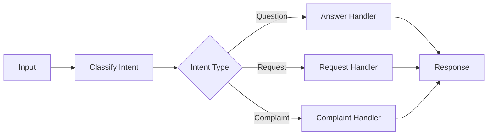
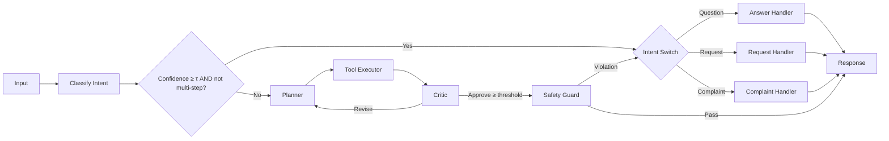

# hybrid-AI-agent-router

# Hybrid vs Deterministic Router

A config-driven application that routes user messages either via **deterministic routing** or a more flexible **hybrid planner**. Both share the same toolset:

- **AnswerHandler**
- **RequestHandler**
- **ComplaintHandler**


##  Quick Start

```bash
pip install -r requirements.txt
```

set in config.yaml

```bash
export OPENAI_API_KEY="sk-..."   
```

Run

```bash
python app.py
```

## Configuration (config.yaml)

```bash
app:
  name: "HybridRouter"
  model: "gpt-4o"
  tau: 0.85                # confidence gate
  temperature: 0.0
  clarify_on_low_conf: true

hybrid:
  enabled: true            # toggle hybrid planner
  max_loops: 2             # planner→executor→critic cycles
  planner_budget: 3
  critic_threshold: 0.6
  ask_before_side_effects: true

openai:
  api_key: null            # fallback if env var not set

logging:
  level: "INFO"
```

## Deterministic Routing


Uses if/then control logic. Fast, predictable, cheap.



## Hybrid (Planner) Routing

Keeps the deterministic branch for high-confidence, simple cases,
but routes ambiguous/compound ones through a Planner → Executor → Critic → Safety → Response loop.




## How to Compare

Toggle in config.yaml:

```bash
hybrid:
  enabled: false   # deterministic-only
```
vs

```bash
hybrid:
  enabled: true    # hybrid planner
```

## Measure:

Task success / precision

Tool calls per task

Latency (p50, p95)

Cost (tokens used)

Escalation rate


## When to Use

Deterministic: high-volume, well-defined intents (cheap & fast).

Hybrid: ambiguous, compound, or novel queries where flexibility matters.

