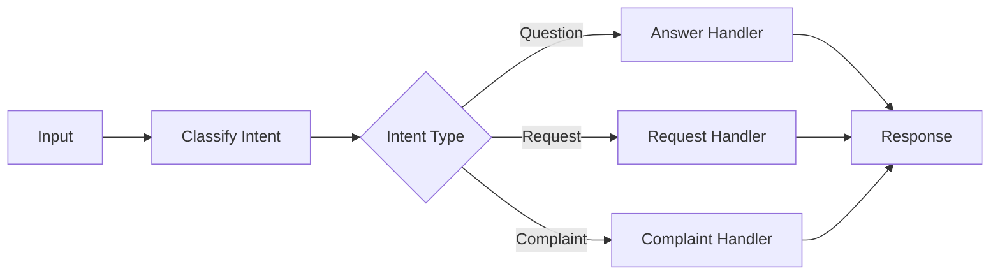
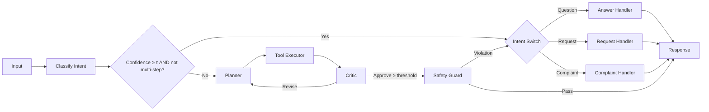

# hybrid-AI-agent-router

# Hybrid vs Deterministic Router

A config-driven application that routes user messages either via **deterministic routing** or a more flexible **hybrid planner**. Both share the same toolset:

- **AnswerHandler**
- **RequestHandler**
- **ComplaintHandler**


##  Quick Start

```bash
pip install -r requirements.txt
```

set in config.yaml

```bash
export OPENAI_API_KEY="sk-..."   
```

Run

```bash
python app.py
```

## Configuration (config.yaml)

```bash
app:
  name: "HybridRouter"
  model: "gpt-4o"
  tau: 0.85                # confidence gate
  temperature: 0.0
  clarify_on_low_conf: true

hybrid:
  enabled: true            # toggle hybrid planner
  max_loops: 2             # planner→executor→critic cycles
  planner_budget: 3
  critic_threshold: 0.6
  ask_before_side_effects: true

openai:
  api_key: null            # fallback if env var not set

logging:
  level: "INFO"
```

## Deterministic Routing


Uses if/then control logic. Fast, predictable, cheap.



## Hybrid (Planner) Routing

Keeps the deterministic branch for high-confidence, simple cases,
but routes ambiguous/compound ones through a Planner → Executor → Critic → Safety → Response loop.




## How to Compare

Toggle in config.yaml:

```bash
hybrid:
  enabled: false   # deterministic-only
```
vs

```bash
hybrid:
  enabled: true    # hybrid planner
```

## Measure:

Task success / precision

Tool calls per task

Latency (p50, p95)

Cost (tokens used)

Escalation rate


## When to Use

Deterministic: high-volume, well-defined intents (cheap & fast).

Hybrid: ambiguous, compound, or novel queries where flexibility matters.


# Hybrid Router Demo

This demo application routes user inputs using a **hybrid strategy**:
- **Deterministic routing** for clear, simple requests.  
- **Agentic (planner-based) routing** when inputs are ambiguous or need multiple steps.  

---

## How It Works

1. **Classification**  
   Every input is first classified with:
   - `intent`: question | request | complaint  
   - `confidence`: how sure the system is about the intent (0–1)  
   - `needs_multi_step`: whether the input likely needs clarification, multiple actions, or more complex handling  
   - `reasoning`: the model’s short explanation  

2. **Routing Decision**
   - If **confidence ≥ τ (default 0.85)** and **multi-step = False** → deterministic path  
   - Otherwise → agentic planner path  

3. **Execution**
   - **Deterministic path** → input routed directly to a fixed handler:  
     - `answer_question`  
     - `process_request`  
     - `handle_complaint`  
   - **Agentic path** →  
     1. Planner selects a tool (one at a time).  
     2. Tool runs and produces output.  
     3. Critic checks if it satisfies the user.  
     4. Loop continues until satisfied or max loops reached.  
     5. Safety checks applied before returning response.  

---
## Example Outputs

### Example 1 — Clear Question
**Input:**  

## Example Outputs

### Example 1 — Clear Question
**Input:**  
What is machine learning?

**Classification:**  
- intent: question  
- confidence: 0.95  
- multi-step: False  
- reasoning: The user is asking for information.  

**Routing:** Deterministic → `answer_question`  

**Response:**  
Machine learning is a subset of artificial intelligence that involves training algorithms to recognize patterns and make decisions based on data.

---

### Example 2 — Clear Request That Needs Multi-Step
**Input:**  
Please schedule a meeting for tomorrow 10am.

**Classification:**  
- intent: request  
- confidence: 0.95  
- multi-step: True  
- reasoning: This is an action request that requires follow-up details (calendar, invitees).  

**Routing:** Agentic Planner → `request_handler`  

**Critic:** Rejected at first (response only acknowledged request, didn’t confirm scheduling).  
Planner retried but still limited (demo handler doesn’t integrate with a real calendar).  

**Response:**  
I understand your concern about: I was double-charged, can you refund and also explain my plan?. I've logged this and will escalate.


